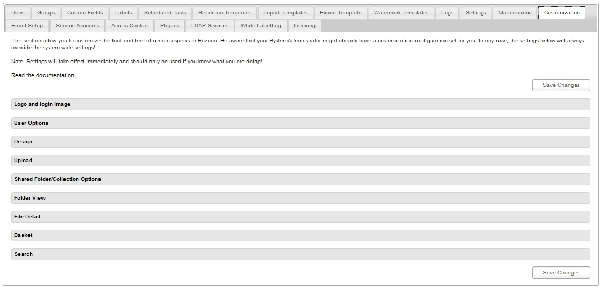
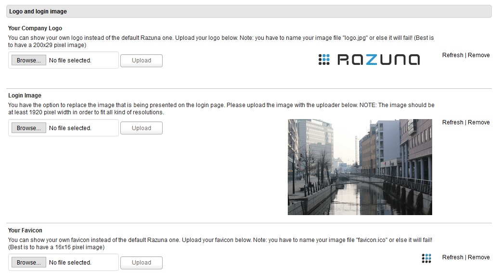
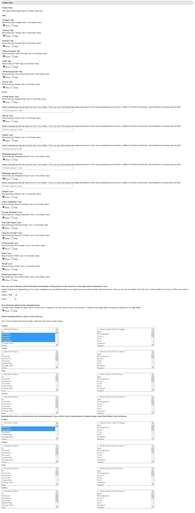
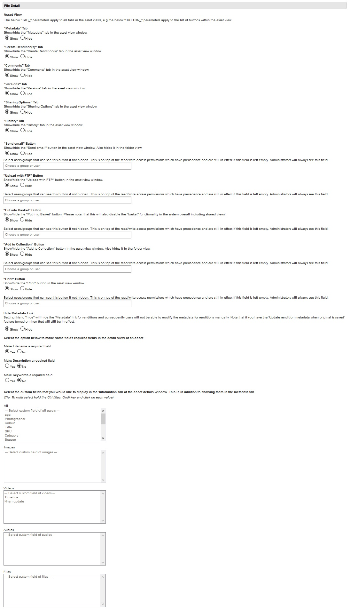
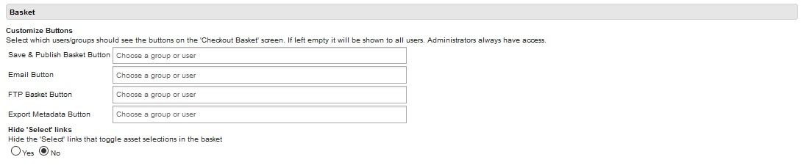

### Customization

This section allow you to customize the look and feel of certain aspects in Razuna. Be aware that your SystemAdministrator might already have a customization configuration set for you. In any case, the settings below will always override the system wide settings!

Note: Settings will take effect immediately and should only be used if you know what you are doing!

[Read the documentation!](http://wiki.razuna.com/display/ecp/Tenant+Customization)

___

Logo and Login Image :

___

User Options :

___

Design :

___

Upload :

___

Shared Folder/ Collection Options :

___

Folder View :

___

File Detail :

___

Basket :

___

Search :

___

