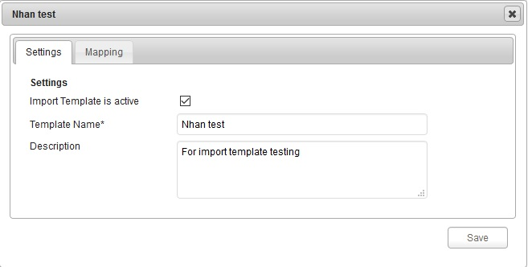
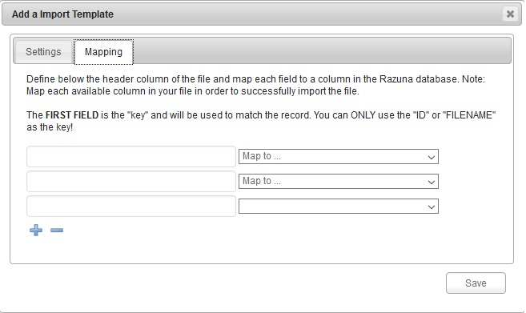

### Import Templates

With Import Templates you map your own import fields to the available fields in Razuna. You can add or modify them any time and will be applied when your users import metadata to assets.

To add your own import fields to the available fields in Razuna system , Please click into "Add a import template" which you can see from the image above . Then the Import template settings window appears to allow you importing the new template.

- Settings : User define the Template name and Description then click Save. Note : "Import Template is active must be checked" to get the activation.

- Mapping : Define below the header column of the file and map each field to a column in the Razuna database. Note: Map each available column in your file in order to successfully import the file. The Plus (+) and Minus (-) icons using for adding or deleting the fields.

___

**Using your Import Template**

To start using your template, go to the folder, where you need to import metadata. Click on "More Actions" and select "Import Metadata" from the dropdown.

A dialogue will open, where you select the various options for your import.

Apply to...: Do you want to apply to only assets in this folder or in all of Razuna

File format: Select the file format of your import file

Choose template: Now choose the import template you just created. Only templates marked as Active will show.

Add or Append: You can choose either to add/replace existing metadata or to append to existing.

Upload file: Find the file on your harddrive and upload.

Once you have filled this in, click on "Import metadata." Please note that it will run for a long time, if you are importing to all assets in Razuna, depending on the number of assets.

