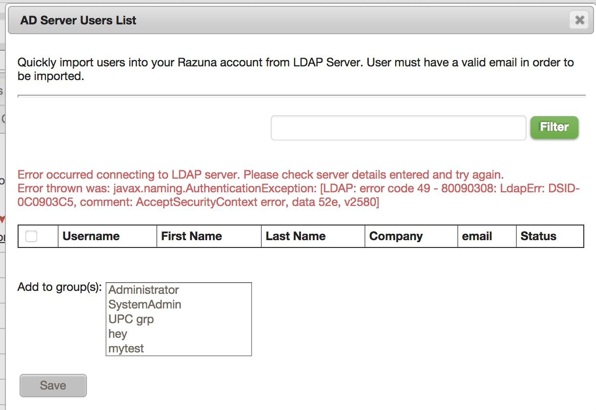
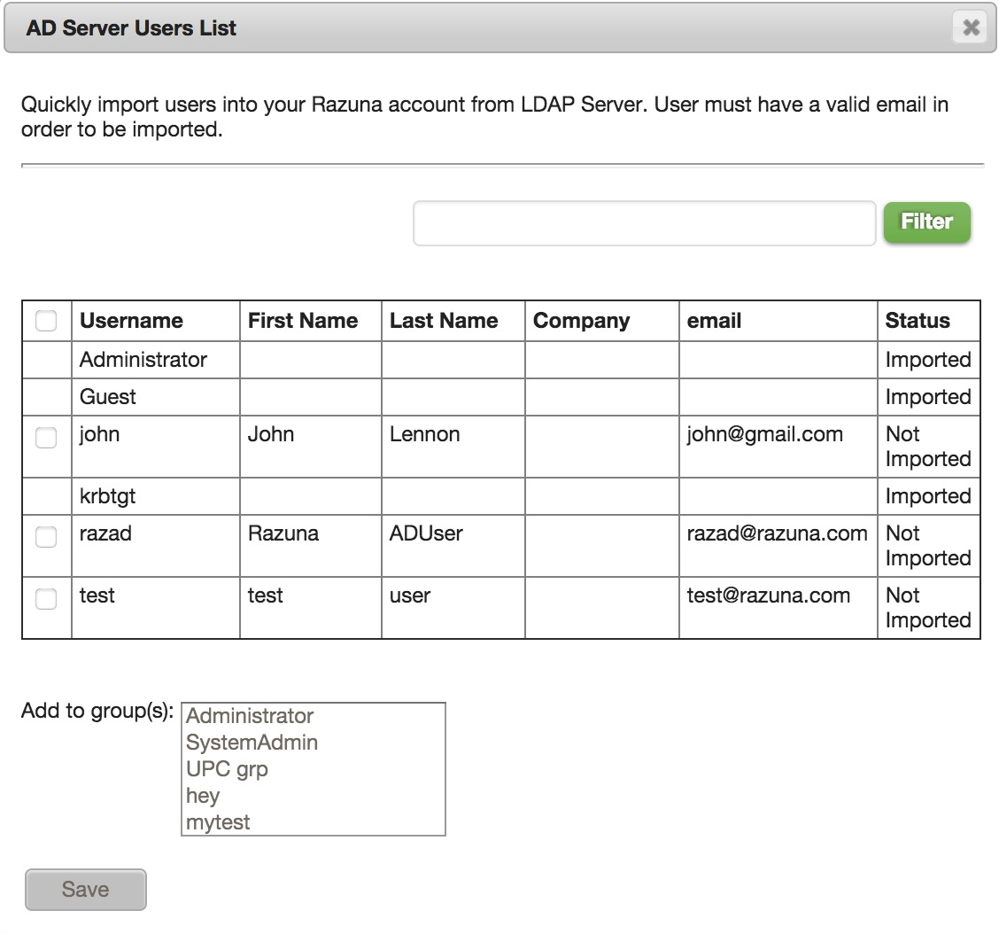

### LDAP Server Details

Please enter the details to connect to the LDAP/AD server and search the directory for users that can be imported into the system.
Once setup please go to 'Users>Import>Import LDAP Users' under Administration to manually import the desired users into the system.
Once imported they will be able to log into the system using their LDAP/AD accounts. [See LDAP/AD Server Setup](http://wiki.razuna.com/pages/viewpage.action?pageId=40140823) page for more details.

To test that the server is setup properly go to Administration>Users>Import>Import LDAP Users and if you see a list of users populate then the connection was successful. If connection fails then you will see a failure message on that screen.

 

If connection is successful you will see a list of users that can be imported into Razuna. Only users with valid emails can be imported. The status column depicts whether user has been imported into the system or not. You can select all available users for import or specific users. You can also specify which groups the user should be assigned to in Razuna.

