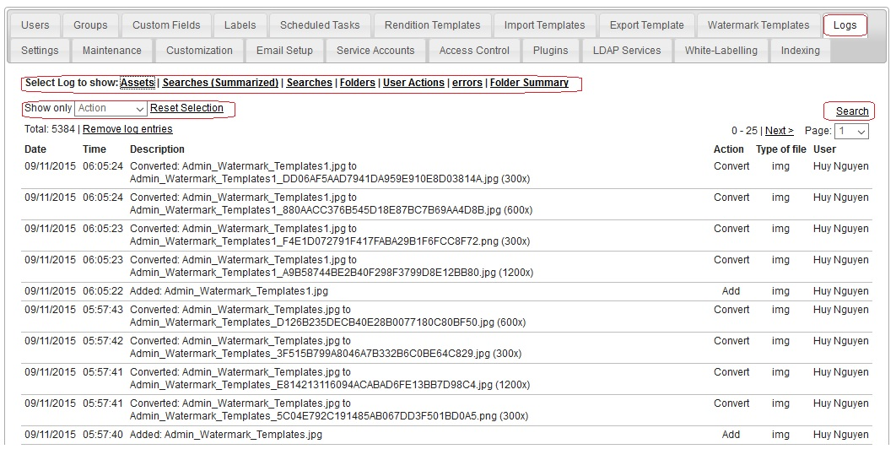
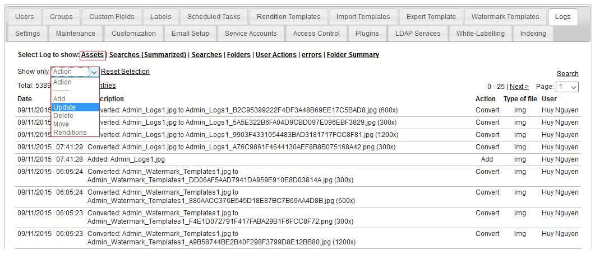
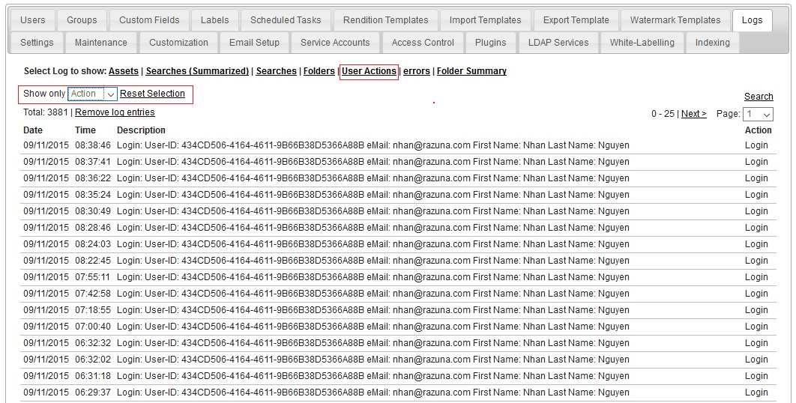
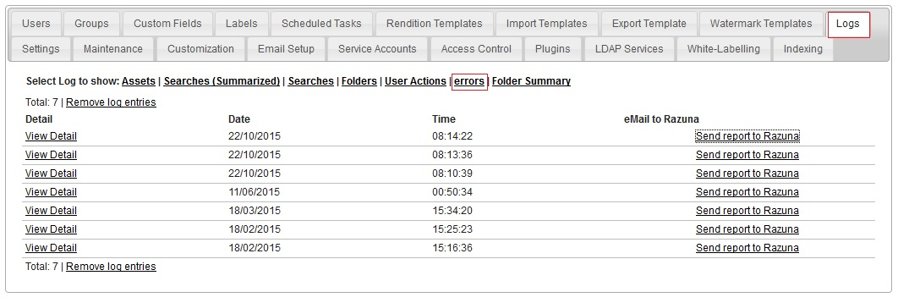
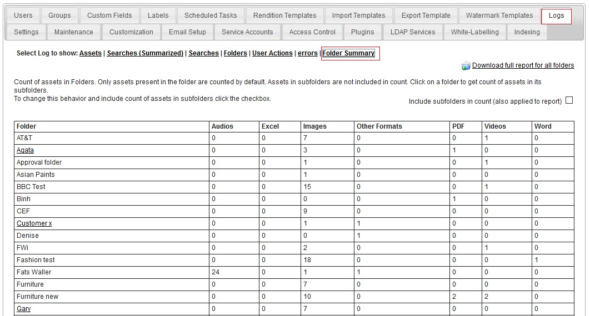

### Logs

Logs in Administration modul is used for showing all the actions in entire system of Razuna. From this image as below you can see all the actions were tracked and showing on the screen such as Logs of Assets , Searches (Summerized) , Search , Folders , User Actions , Errors , Folder Summary.

- Assets : Will show entirely actions related to assets likes : add , update , delete , move , rendition. Each action in system was catched and saved then show in the Logs of Assets following the : Date , Time , Description , Action , Type of File , User. In addition , user can choose one of action types from dropdown list menu to get the different results.

___

- Searches (Summerized) : This fuction shows the summerized of keywords which were used to search assets in Razuna system. We can use "Type of Asset " to filtering the content of search result by some types are : Images only | Documents only | Videos only | All asset.

___

- Searches : This modul also to show the results of keywords which were used to search assets in system , however the result will be show in more detail such as : Date of Search , Time of Search , Search for (keywords) , Assest found , Type of Asset , User.

___

- Folders : Folders Logs function for showing the action status of folders in Razuna system such as : Add , Update , Delete , Move. As we can see from the image as below , its show the Time , Date , Description , Action and User do the action.

___

- User Actions : User actions modul is to shows the status of users in system with actions like : Login , Logout , Delete , Add , Update , Delete. This also has a dropdown list selection to filter the action to get the result following the selection of user.

___

- Errors : This section is used to show the errors of system and user can send these errors to Razuna by clicking to "Send report to Razuna" to help us fix it and improve the system.

___

- Folder Summary : Count of assets in Folders. Only assets present in the folder are counted by default. Assets in subfolders are not included in count. Click on a folder to get count of assets in its subfolders.
To change this behavior and include count of assets in subfolders click the checkbox. 

