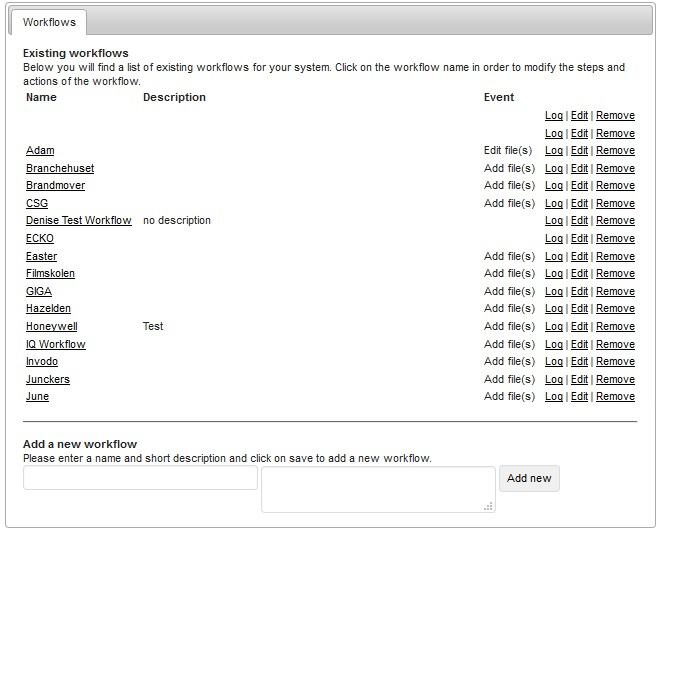

### Plugins

* Razuna Metaform Plugin : The metaform plugin gives you the option to add a metadata form during uploading.

* Razuna Workflow Plugin : Workflow plugin by the official Razuna Team. Delivers mechanism to put assets and folders into a workflow.

___

Razuna Metaform Plugin Setting :

___

Razuna Workflow Plugin Setting :

___