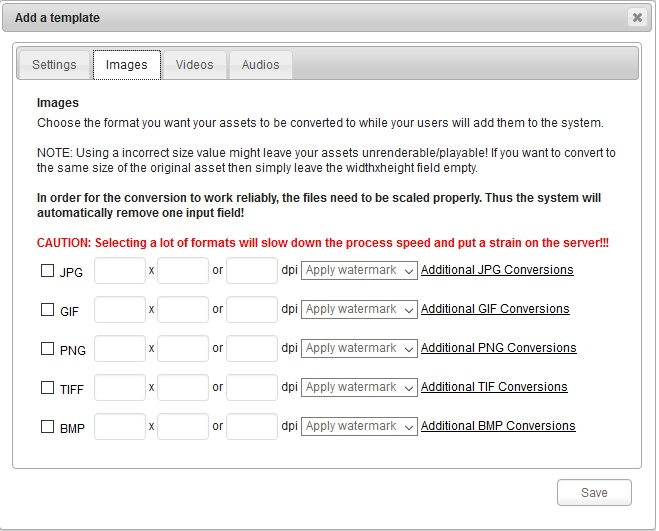
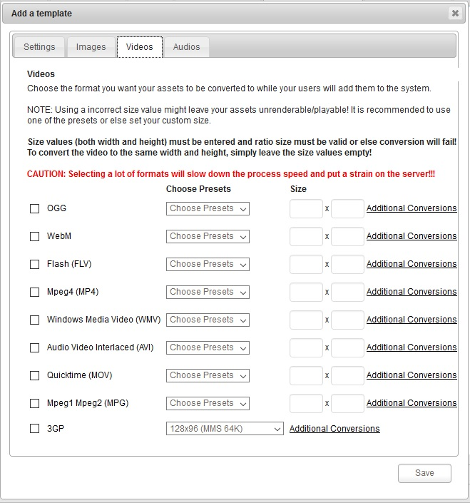
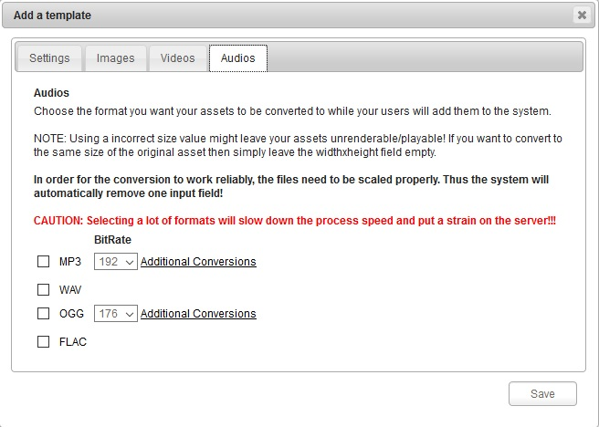

### Rendition Templates

Rendition Templates allow you to define certain actions during uploading of any asset. With Rendition Templates you can also convert assets to different formats while adding them to the system.

To create a new template , Please click into "Add a template" in the right corner on top position.

A new window appear to allow you setup the new (Name , Description) template :

___

 Images Rendition Settings :

Choose the format you want your assets to be converted to while your users will add them to the system.

NOTE: Using a incorrect size value might leave your assets unrenderable/playable! If you want to convert to the same size of the original asset then simply leave the widthxheight field empty.

___

 Videos Rendition Settings :

Choose the format you want your assets to be converted to while your users will add them to the system.

NOTE: Using a incorrect size value might leave your assets unrenderable/playable! It is recommended to use one of the presets or else set your custom size.

___

 Audios Rendition Settings :

Choose the format you want your assets to be converted to while your users will add them to the system.

NOTE: Using a incorrect size value might leave your assets unrenderable/playable! If you want to convert to the same size of the original asset then simply leave the widthxheight field empty.

