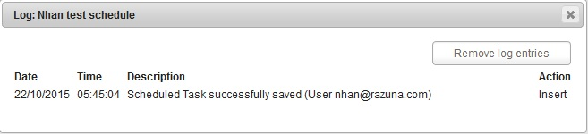

### Scheduled Tasks

Scheduled Tasks allow you run certain tasks, like importing assets from different sources automatically into Razuna. You can run the tasks once, have them occur at the certain time or more.

User just click to "New Scheduled Task" to create new Task. From this image as below , you can see the list of tasks which  were created on screen.

 - "Log" function is used to showing the Action (Insert) , Description (Status of Task) , Date and Time of Task action.

 - Action :

 * The Yellow arrow icon is used for perform task action when you click into it.

 * The Recycle Bin icon is used for delele the task.

And the New Task Form will appears , Please enter the Task name and Method (FTP connection) , Choose Location , Date - Time , Rendition Templates... and click Save to finish.

