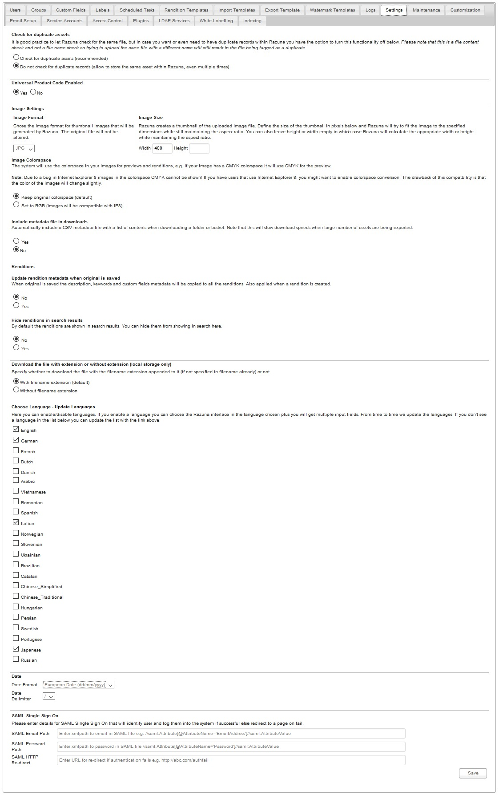

### Settings

These settings of Razuna allows you to enable or disable system attributes such as : Image Settings , Check for duplicate assets , Include metadata in downloads , Renditions , Date format , Languages settings ... etc.

From the image as below you can see the descriptions in detail of these settings :

