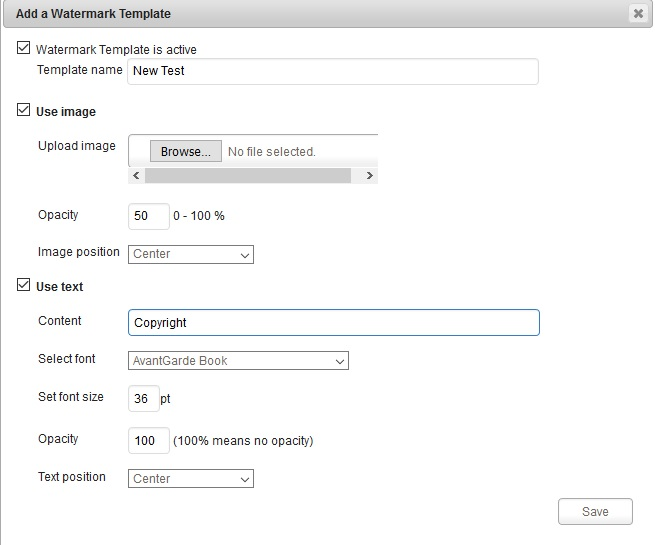

### Watermark Templates

With Watermark Templates you can create different watermark settings and apply them to your rendition template or when you create additional renditions.

From here , we can use Image or Text or both of Image and Text to set the watermark template for our assets to keep the copyright of our assets.

 

To create a new Watermark Template , Please click into "Add a Watermark Template" as the image from above. New window appears and allow us to create new template.

Click to "Use Image" checkbox if you want to use image for Watermark Template then choose your image from local machine.

"Use Text" for using your text for Watermark and you can enter the content for this Template.

After all , just click "Save" to complete. Your Watermark Template will be show on Import Templates List of Watermark Template and can be edit the content , image or text of template or even is delete it anytime you want. 