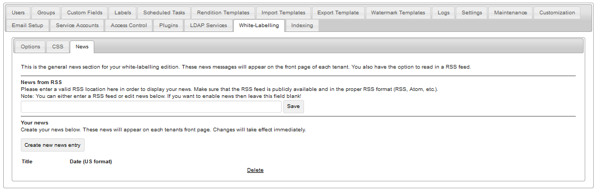
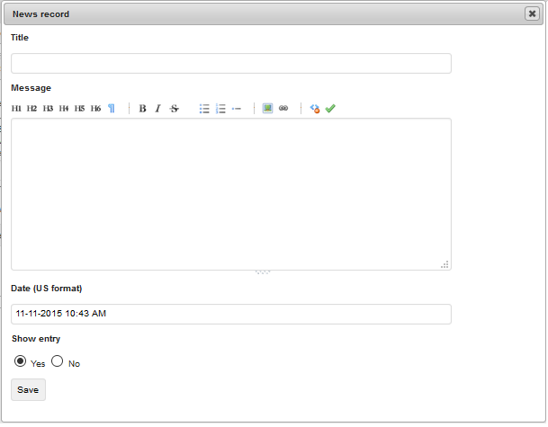

Options :

Below are options to "White-Label" many aspects of your Razuna installation. Changes will take effect immediately. Leaving a field empty will reset it back to the default system wide setting!
(Tip: You can use HTML tags in the textarea fields)

___

CSS :

The area below allows you to define your own CSS styles or overwrite existing ones. For obvious reasons, you should not copy the whole Razuna CSS into the area below, but simply overwrite the ones you want. Here is the link to the [Razuna CSS](http://demo.padma.razuna.org/global/host/dam/views/layouts/main.css).

 

___

News :

This is the general news section for your white-labelling edition. These news messages will appear on the front page of each tenant. You also have the option to read in a RSS feed.

Please click to "Create new news entry" to create new messages on the frontpage.

