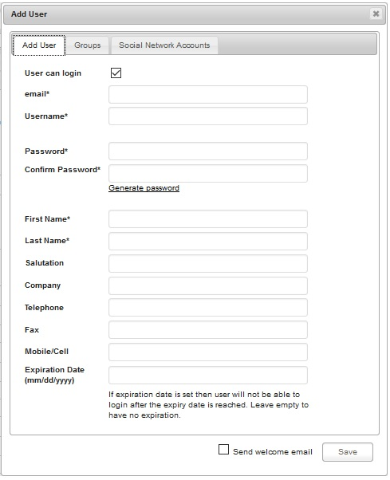
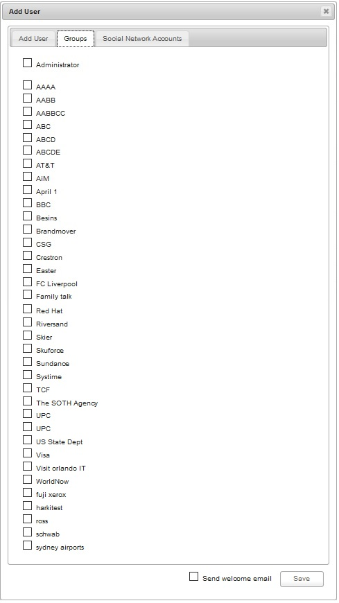
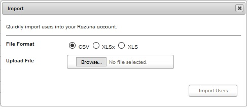

### Users

Setting up User

The User Management is only available to Users of the System Administrator or Administrator Group. You can add/modify users in two places, one time in the Razuna Administration and one time in the DAM section with the Administration link. Both will show you the same users and groups.

The difference is that within the DAM Administration you will also have access to other DAM related settings, like Logs, Scheduled Tasks, Custom Fields and more.

How to do it :

From the windows of Razuna DAM , you can click into your username from the right corner on top. Then choose "Administration" to go to User Management Page.

Please see images as below :

As you can see on the image below , it shows the total number of the users on the list. Besides of that , we can do some features such as : Search , Add , Import and Export user accounts.

The search user feature will be used for finding the users which you want to be listed. You can use username , email or company name to fill in the textbox and click into Search button to finish.

___

For adding an user , we just click to Add User link and the new windows will prompt on the screen. Please fill in the necessary information to the form and after that we can set username into group name to set the access right for each user. And click Save to complete.

___

Add user to groups :

___

Razuna DAM also support for users social accounts to login such as : Facebook , Twitter , Google , etc...

___

Our system support for import and export user databse with :

Import Feature :

___

Export Feature :

