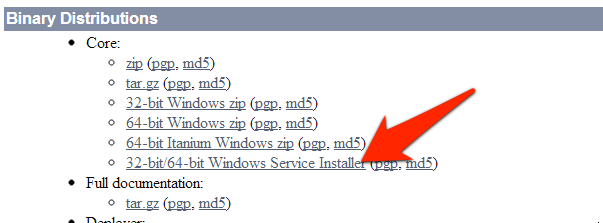

# Windows

Razuna has been tested on Windows 7 and Server 2003, 2008 (R2) and 2012.

** Install Java**

You need to install Java7 (1.7). Please grab the JDK package! You will find both [installers at the Java download page](http://www.oracle.com/technetwork/java/javase/downloads/index.html). Do NOT download Java8, but download the Java 7 JDK installer!

Additionally you need to define a system wide environment variable called "JAVA_HOME" and "JRE_HOME". The path to Java will be (depending on your installation) most of the time: C:\Program Files\Java\jdk7.xxx (JAVA_HOME) or C:\Program Files\Java\jre7 (JRE_HOME). It is crucial that the JAVA_HOME variable is correctly set. Do not continue until this is setup properly!

* Installation Paths : All the below applications come most of the time with an installer. Make sure to install all applications to the root level, e.g. C:\ImageMagick or C:\Exiftool. Theoretically, Razuna can manage spaces in the application path, but it is better to not have spaces at all!

___

**Install Ghostscript**

Grab the latest Ghostscript installer from the projects page at [http://sourceforge.net/projects/ghostscript/](http://sourceforge.net/projects/ghostscript/) and install it.

* Note : You need to install the 32bit version of Ghostscript! ImageMagick (which uses Ghostscript internally) is looking for the 32bit version.

___

**Install ImageMagick**

[Download the latest ImageMagick Windows Binary release](http://www.imagemagick.org/script/binary-releases.php#windows) form the ImageMagick website and install it. Make sure to use the recommended release (Win32 dynamic at 16 bits-per-pixel").

___

**Install FFMpeg**

There are no official FFmpeg libraries for Windows available. Fortunately, there are some serious volunteers that compile FFmpeg for the Windows platform. We've had great success with the builds from [http://ffmpeg.zeranoe.com/builds/](http://ffmpeg.zeranoe.com/builds/).

Please install the following builds only:

| Platform     |URL                                                                                      |
|:-----------: |:---------------------------------------------------------------------------------------:|
| 32-bit       |[http://ffmpeg.zeranoe.com/builds/win32/static/ffmpeg-20140506-git-2baf1c8-win32-static.7z](http://ffmpeg.zeranoe.com/builds/win32/static/ffmpeg-20140506-git-2baf1c8-win32-static.7z)|
| 64-bit       |[http://ffmpeg.zeranoe.com/builds/win64/static/ffmpeg-20140506-git-2baf1c8-win64-static.7z](http://ffmpeg.zeranoe.com/builds/win64/static/ffmpeg-20140506-git-2baf1c8-win64-static.7z)|

Extract the archives and move it to the C:\ffmpeg directory.

___

**Install Exiftool**

The latest Exiftool version can be download from the [official Exiftool website](http://www.sno.phy.queensu.ca/~phil/exiftool/). Once downloaded, create a folder on C: called "exiftool" and copy/move the downloaded executable to it. Then rename the executable to "exiftool.exe". You **need** to rename the executable or else it will not work. Exiftool runs on all versions of Windows (including Windows 7)

___
**Install DCraw (optional)**

Again as DCraw comes from the Linux community there are no official DCraw builds available. Download a compiled one here [http://www.centrostudiprogressofotografico.it/en/dcraw/](http://www.centrostudiprogressofotografico.it/en/dcraw/). Once downloaded, rename the executable to "dcraw.exe" and move it to c:\dcraw\dcraw.exe.

___
**Install UFraw**

UFraw has a nice Windows Installer available. in order to install UFraw you also need to install Gimp. Simple follow the [instructions on this page](http://ufraw.sourceforge.net/Install.html#MS) (disregard any mentioning of moving a libpng library and you should be fine). In short, download from here [http://sourceforge.net/projects/ufraw/files/ufraw/ufraw-0.19.2/ufraw-0.19.2-2-setup.exe/download](http://sourceforge.net/projects/ufraw/files/ufraw/ufraw-0.19.2/ufraw-0.19.2-2-setup.exe/download) and install.
___
**Install MP4Box**

Download the [MP4Box Installer from here](http://www.videohelp.com/tools/MP4Box). Once downloaded execute the installer. Make sure to install it to the C:\MP4Box directory.
___

**Setup Razuna standalone**

If you have not already done so, [download the latest Razuna release](http://razuna.org/download) from [http://razuna.org](http://razuna.org). We recommend to extract Razuna to the "C:" directory. Just make sure to have NO SPACE int he path to Razuna! The Razuna standalone server comes with Tomcat pre-configured.

___

**Start the Razuna server**

The final task left to do now is to startup the application server. In order to do so, navigate to the "bin" directory of the Razuna folder (C:/tomcat/bin/) and start the server with:

```
./startup.bat
```
___
**Navigate to Razuna**

Once the server has successfully started you should navigate to [http://localhost:8080/razuna](http://localhost:8080/razuna) and you will be presented with the Firsttime Wizard to finish setup.

___
**Advanced Setup**

The above Razuna Standalone download comes with Tomcat pre-configured. On Windows you might want to consider using the Tomcat Service installer directly from the Tomcat website. This is a nice installer that installs Tomcat as a service automatically.

___
**Install Tomcat as a service**

You can grab the installer from tomcat.apache.org directly. Make sure to get the installer as outlined int he screen shot:



Once you run the installer, select the advanced option and check the Service Startup and the Native option.


For best performance put Tomcat into the root directory of your server:


___

**Configure Tomcat service**

One of the most important settings for Razuna is to adjust the memory settings for Tomcat. If your memory setting is too low, Razuna might not even startup properly. Rule of thumb is to have a server with at least 8GB Ram. 16GB is good, while 32GB is the best. If you are planning to load a lot of data into Razuna you want to have more RAM !

The Tomcat service installer comes with a UI to edit the tomcat settings. Do a right click on the Tomcat service in your taskbar and click on "Configure" (if you don't have the icon in your taskbar you can execute the service application by double-clicking on the Tomcat7w.exe file).


Within the configuration to the **Java** tab and set the memory settings (see the chart below about the memory values):


The following memory settings should be done:

**Default:**

* Initial memory pool: 2048
* Maximum memory pool: 2048
* Thread stack size: 1024

Note :  `You can only set the memory higher then 1024 if you are running a 64-bit system AND Java in 64-bit`

If you are planning to add a lot of images to the system and/or have large files (around 500MB per file) you should increase the memory up to 8192 for both initial or maximum memory pool. Please make sure that you have enough memory in your system to scope with this large value. Also, it is recommended to lower this value to 4096 on normal usage (The less memory Tomcat has the better it performs).


